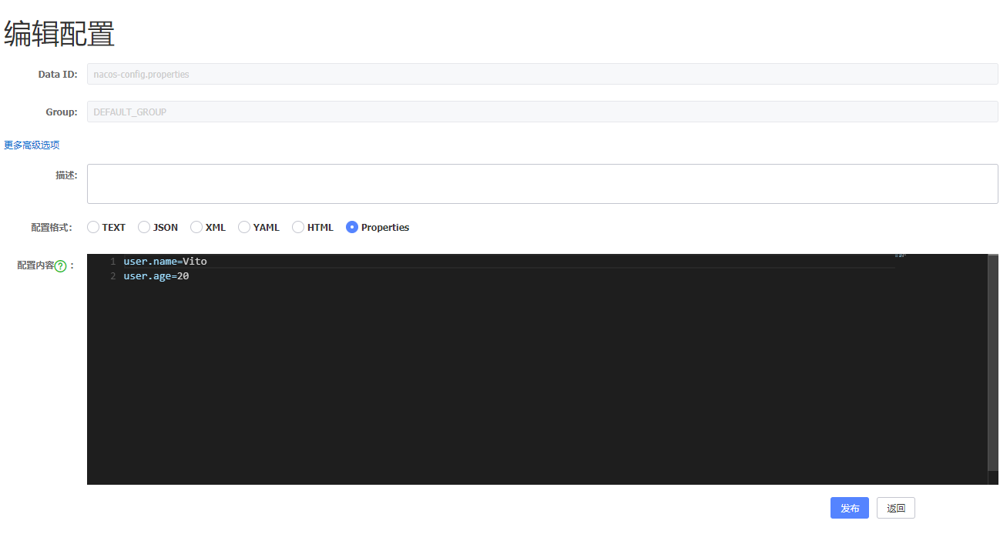

# Alibaba Nacos配置中心demo
## Nacos Server
下载地址：https://github.com/alibaba/nacos/releases  
执行`./startup.cmd`启动  
访问：http://localhost:8848/nacos/  
账号密码：`nacos/nacos` 登录后台  
在配置列表中增加配置，如图

## 启动项目
访问地址：[http://localhost:18084/user](http://localhost:18084/user) 显示配置内容
## 测试
...
## 参考
https://nacos.io/zh-cn/docs/quick-start.html
